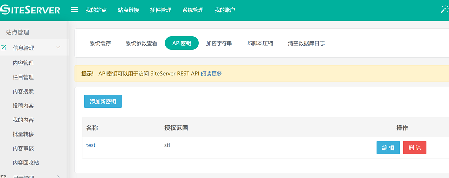
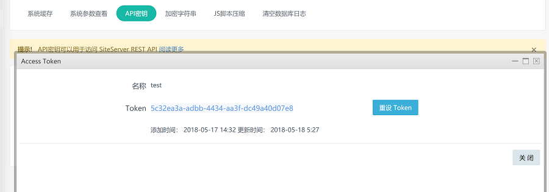

# 身份认证

对REST API 发起的任何请求都必须通过身份验证，未验证的请求将返回 401 Unauthorized 错误。

## 获取API密钥

所有的REST API调用均通过专门的API密钥完成，该密钥是一串字符串，SiteServer CMS 后台能够对密钥进行管理，设置此密钥的访问权限、替换或让此密钥失效。

使用最高权限的管理员登录 SiteServer CMS 管理后台，进入菜单`系统管理 -> 实用工具 -> API密钥`：



在此可以新增密钥，设置授权范围以及删除密钥。新增密钥并设置好授权范围后点击API密钥名称，进入密钥查看界面：



建议定期更换API密钥以确保安全，可以点击`重设 Token`按钮更换API密钥。

## 使用API密钥进行身份认证

获取API密钥之后需要在调用REST API时将密钥通过请求发送给服务器，目前系统支持两种方式发送API密钥：

- 通过Header发送API密钥
- 通过传参发送API密钥

如果身份认证成功，返回HTTP 200，如果身份验证失败，返回HTTP 401。

### 通过Header发送API密钥

使用Header方法送API密钥需要在发起请求时将密钥放到 `X-SS-API-KEY` Header中：

请求

```
GET https://example.com/api/v1/sites
```

请求 Header

```
X-SS-API-KEY: 5c32ea3a-adbb-4434-aa3f-dc49a40d07e8
```

响应

```
200
```

### 通过传参发送API密钥

使用传参方法送API密钥需要在发起请求时将密钥放到 `apiKey` 的请求参数中：

请求

```
GET https://example.com/api/v1/sites?apiKey=5c32ea3a-adbb-4434-aa3f-dc49a40d07e8
```

响应

```
200
```