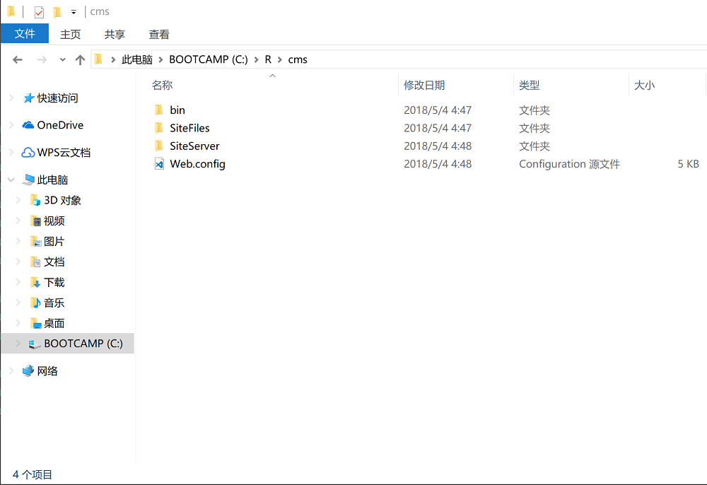
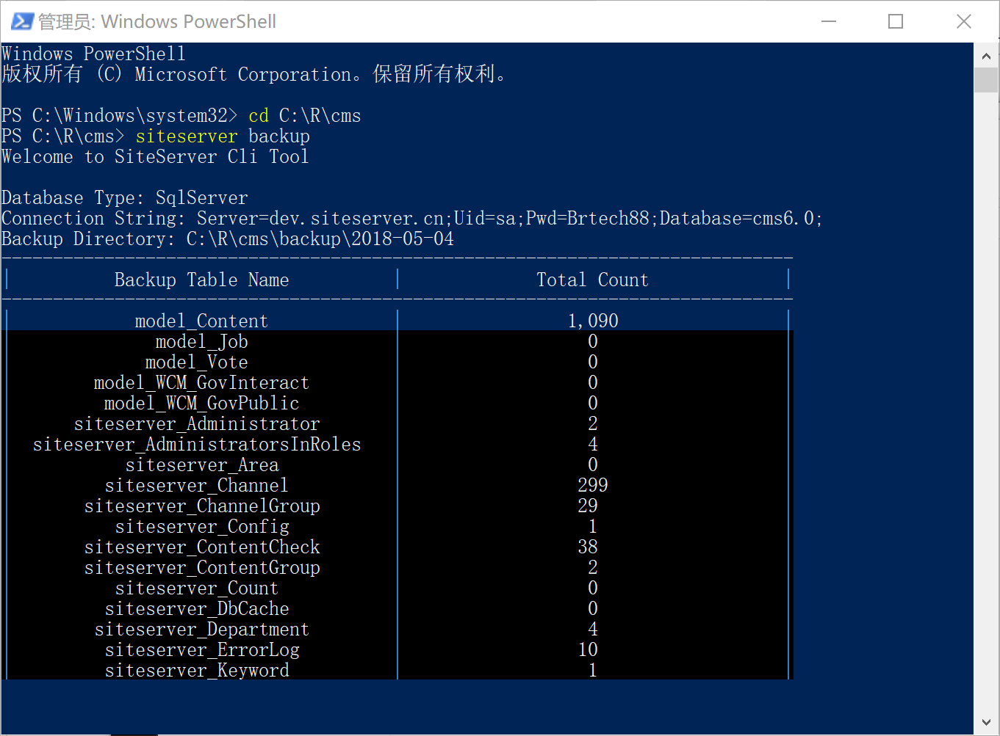
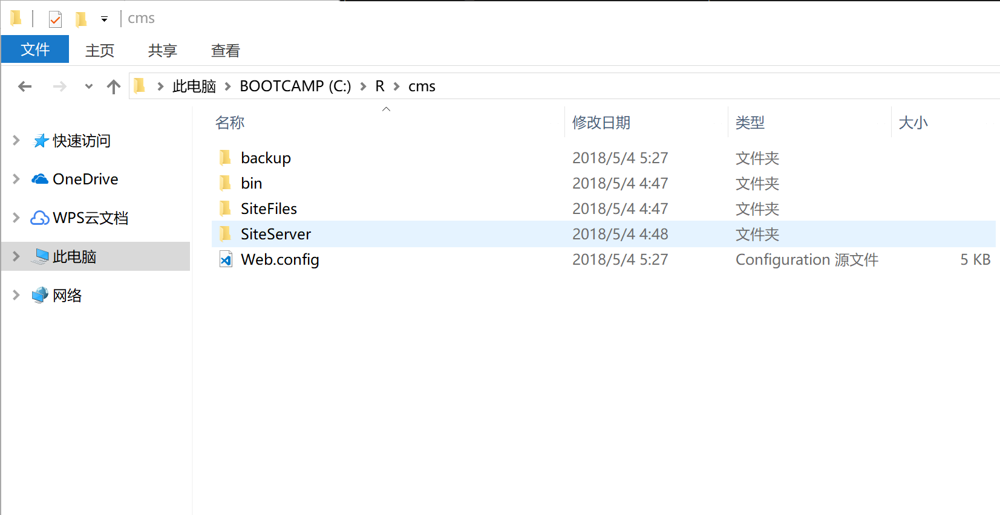
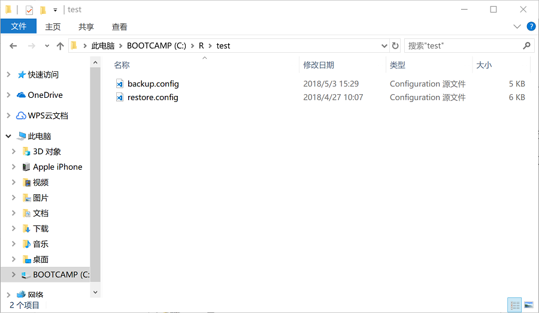
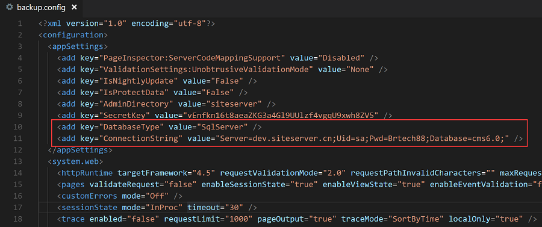
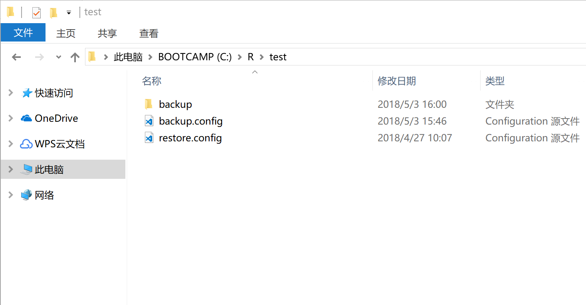
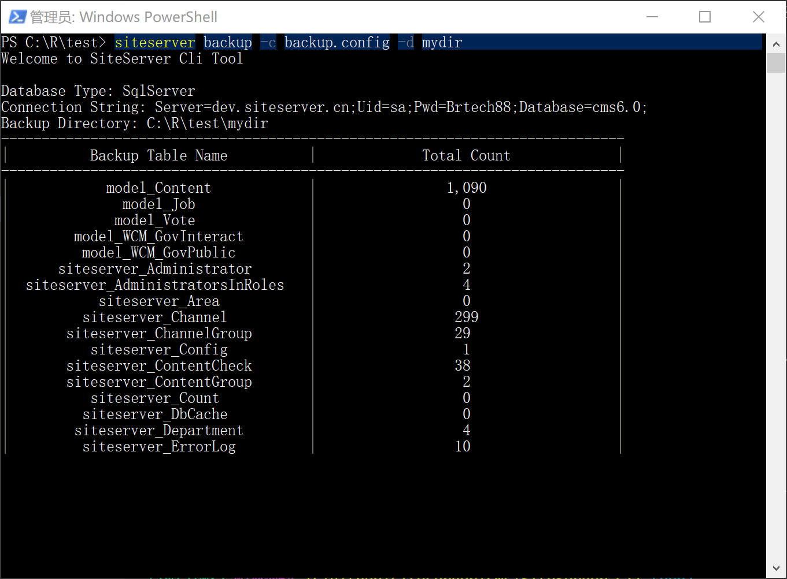
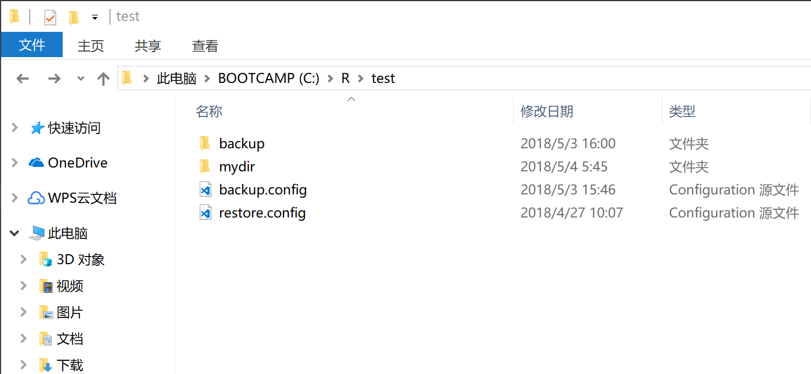

# 备份命令

备份命令为： `siteserver backup`，可以设置参数控制备份选项。

## 1、开始使用

备份命令默认读取当前目录下的 Web.config 文件，从中获取数据库连接字符串，进而将数据库备份到backup文件夹中。

备份命令目前还不支持增量备份，只支持完全备份，即备份命令将把数据库中所存的所有数据备份至文件夹中，如果数据库中数据量太大，请不要频繁使用备份命令，以免影响数据库性能。

备份命令支持 SiteServer CMS 支持的所有数据库，包括 SQLSERVER、MySQl、PostgreSQL以及Oracle。

例如我们希望备份指定的 SiteServer CMS 系统，找到系统所在文件夹路径：



将命令行切换到此文件夹，并运行备份命令：

`
siteserver backup
`

可以看到命令开始执行，界面将显示备份进度：



备份命令将逐一遍历数据库中的表，将表中的内容完整导出至文件中，备份结束后，打开文件夹路径，将看到根目录下多了一个backup文件夹：



backup文件夹即为备份存储的文件，可以看到里面的文件夹结构大致如下：

```
backup
└── 2018-05-04
    └──Database
        ├── model_Content
        |   ├── _metadata.json
        |   ├── 1.json
        |   └── 2.json
        ├── siteserver_Administrator
        ├── siteserver_AdministratorsInRoles
        ...
```

备份命令默认将备份存储在backup文件夹下的一个以当天日期命名的文件夹中，以方便多次备份后找到对应的备份文件。

数据库中的每个表均有一个以表名命名的文件夹，其中**_metadata.json**存储表的结构信息，**1.json**、**2.json**等文件存储表数据信息。

## 2、指定Web.config文件

如果需要备份的数据库信息存储在其他文件中，可以通过`-c`或`--config=`加文件名的方式指定config文件。

下图显示的文件夹中有两个config文件，backup.config以及restore.config，分别存储了希望备份数据的数据库连接字符串以及希望恢复数据的数据库连接字符串：



打开backup.config，可以看到里面存在连接 SiteServer CMS 所用到的数据库类型 DatabaseType 以及连接字符串 ConnectionString：



将命令行切换到此文件夹，运行：

`
siteserver backup -c backup.config
`

命令结束后打开文件夹，可以看到多出了备份文件夹backup：



## 3、指定备份存储文件夹

如果需要将备份文件存储在其他文件夹中，可以通过`-d`或`--directory=`加文件夹名称的方式指定备份存储文件夹。

`
siteserver backup -c backup.config -d mydir
`



命令结束后打开文件夹，可以看到多出了备份文件夹mydir：

