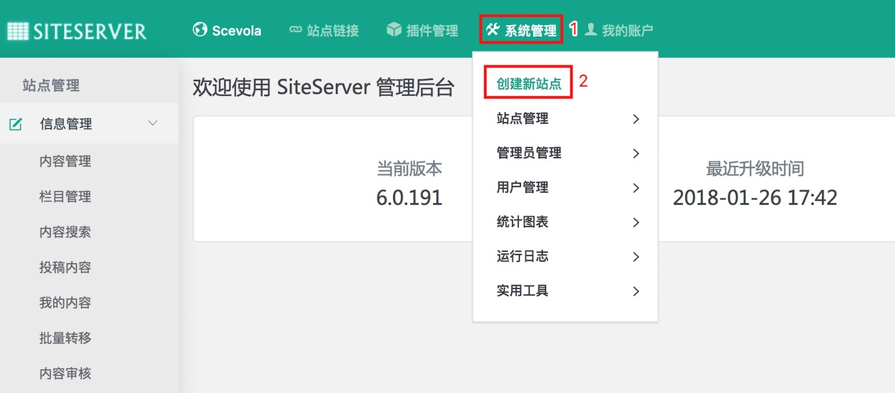
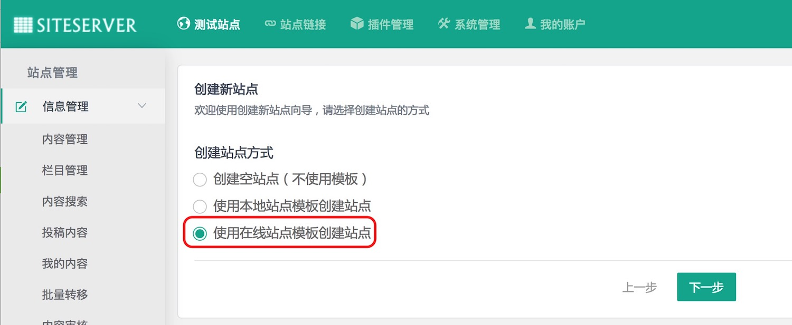
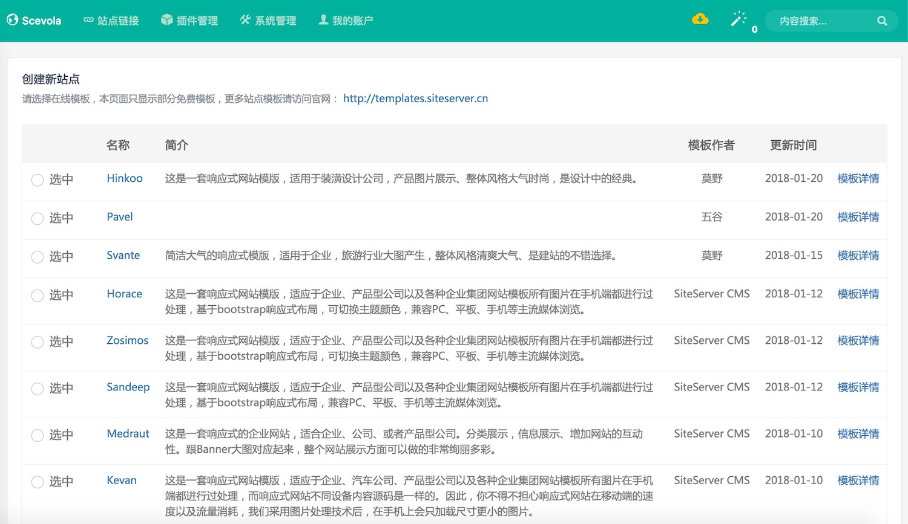
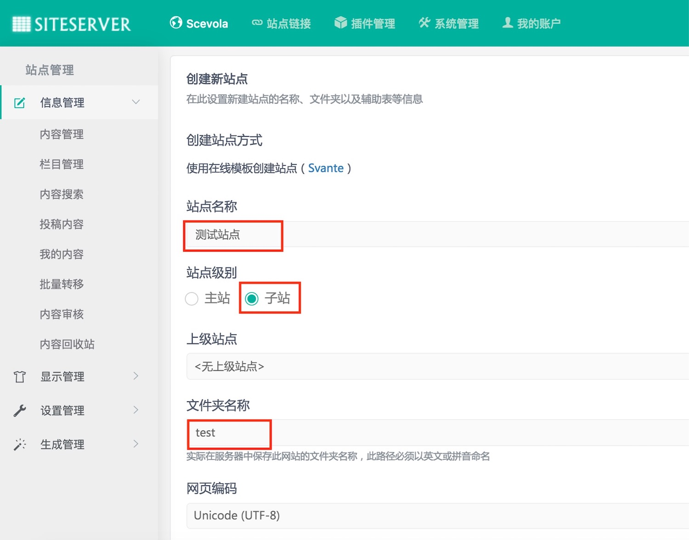
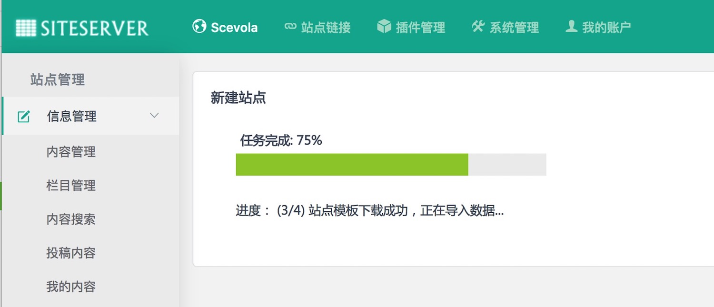
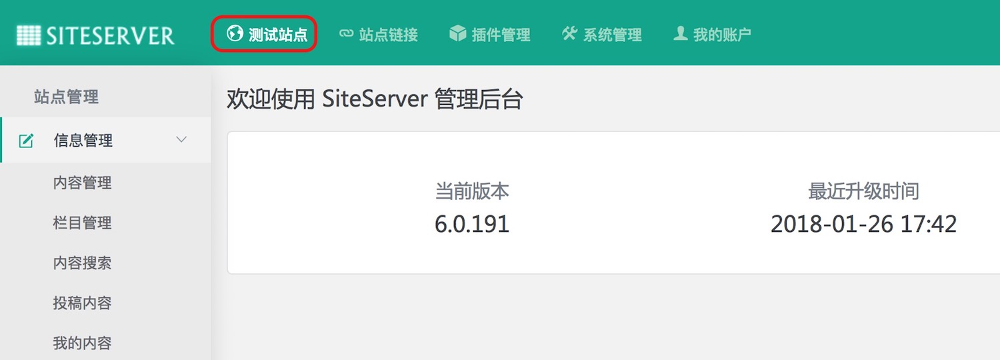

# 如何创建站点？

SiteServer CMS 创建站点的方式有三种，在这以“使用在线站点模板创建站点”方式来讲解如何创建一个站点的具体步骤。

## 1、进入创建站点菜单

如上图所示，在登录SiteServer CMS 后台之后，鼠标移到“系统管理”菜单上，在弹出的下拉菜单中选择“创建新站点”菜单。

## 2、选择创建站点方式

点击“创建新站点”菜单，进入选择创建站点方式界面：

如上图所示，在这选择“使用在线站点模板创建站点”的方式，然后点击下一步。

## 3、选择站点模板

SiteServer CMS 提供了许多免费的在线站点模板，如下图所示：

在这随意选择一套站点模板，然后点击下一步。

## 4、填写站点属性

选完站点模板之后，就需要填写站点的相关属性，如下图所示：

通常情况下，只需要设置三个属性：站点名称、站点级别（一般建议选择子站）、文件夹名称（如果站点是子站的话）。设置好之后点击下一步。

## 5、创建站点

在设置好站点属性后，点击下一步，系统就开始创建站点了，在这一步可以看到创建进度，如下图所示：

一旦创建完成，系统会自动切换到刚创建站点的管理界面，如下图所示：

在上图红框可以看到，当前站点是刚刚创建的“测试站点”。至于，整个创建站点的工作就全部结束了。