# 如何安装SiteServer CMS 

在安装SiteServer CMS之前，需要确保已经完成了以下工作：

+ 已经安装好了IIS6.0或以上版本；
+ 已经安装好了.net framework 4.5.2或以上版本；
+ 已经安装好了MySql、Sql Server、PostgreSQL或Oracle四种数据库的任何版本；

安装SiteServer CMS系统可以按以下四步进行：

+ 1、下载SiteServer CMS系统安装包；
+ 2、新建空数据库；
+ 3、新建IIS站点；
+ 4、运行SiteServer CMS安装程序；

下面就按照这四步展开来详细讲解。

## 1、下载SiteServer CMS系统安装包

可以通过官方产品网站去下载，官网地址为：[https://www.siteserver.cn](https://www.siteserver.cn)。

另外也可以到官方GitHub源码仓库中下载，具体地址为：[https://github.com/siteserver/cms](https://github.com/siteserver/cms)。

下载下来是一个siteserver_install.zip压缩包，解压到 E:\siteserver_install 之后效果如下图所示：

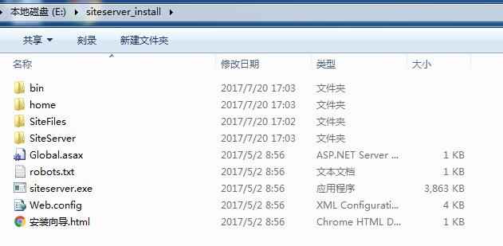

注意：后面IIS配置站点时，需要把网站物理路径指向这里的： E:\siteserver_install 

## 2、新建空数据库（以SqlServer为例）

启动SQL Server Management Studio 管理器，如下图所示：

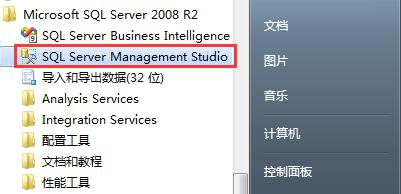

点击上图红框图标，打开数据库连接界面：

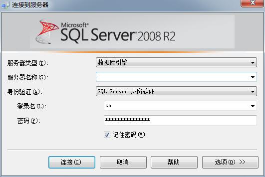

填写连接数据库用的账号和密码，如果数据库是安装在本机，则服务器名称填写一个 “.” 或 “127.0.0.1” 即可。填写完成之后点击 “连接” 按钮进到以下界面表示数据库连接成功：

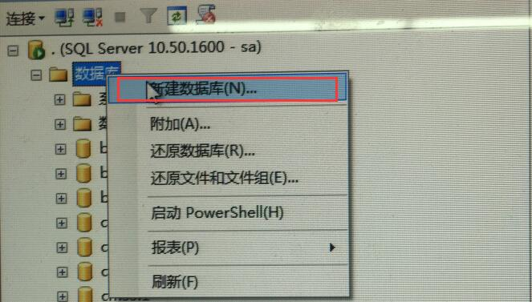

在上图选中 “数据库” ，然后鼠标右键选择 “新建数据库” 进到新建数据库界面：

在上图中只需要填写数据库名称即可，点确定即可完成数据库新建的工作。

## 3、新建IIS站点

进入：控制面板--->系统和安全--->管理工具，如下图所示：

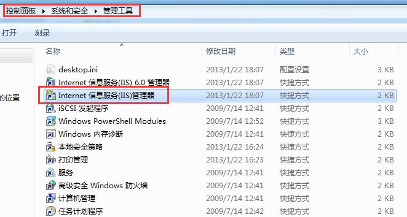

双击上图红框 “Internet 信息服务(IIS)管理器” ，启动IIS管理器，如下图所示：

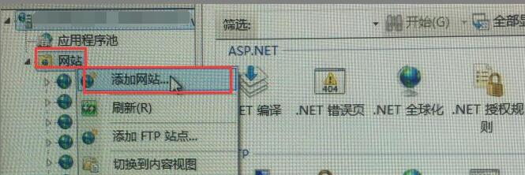

在上图选中 “网站” ，然后鼠标右键选择 “添加网站” 进到添加网站界面：

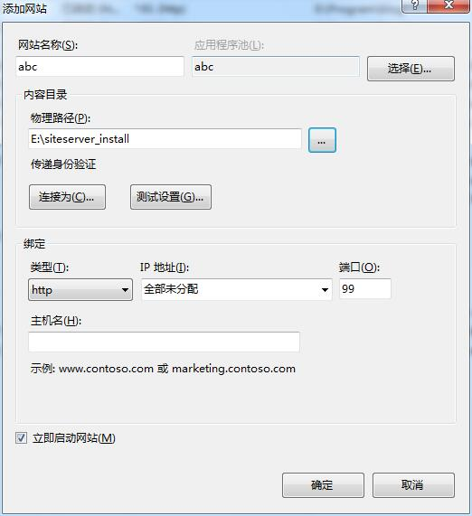

在这里：
**网站名称：** 随便填写一个（在这填写的是abc）；
**应用程序池：** 默认和站点同名；
**物理路径：** 需要填写成刚才在第一步解压安装包所在物理路径，即：E:\siteserver_install；
**端口：** 填写一个不小于80且未被占用的端口即可（在这填写的是99）； 

点击确定网站创建成功，然后需要设置一下应用程序池，如下图所示：

鼠标双击 “abc”，弹出应用程序池设置界面：

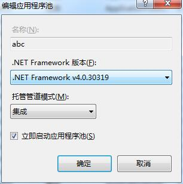

**.Net Framework版本：** 一定要选择4.0.xxx（安装.Net Framework时一定要安装4.5.2或以上版本，但安装完在这显示为4.0.xxx）；
**托管管道模式：** 一定要选择集成模式；

到这，新建IIS站点就完成了。

## 4、运行SiteServer CMS安装程序

打开浏览器（强烈建议Chrome或Firefox），因为刚才在第3步新建IIS站点时端口填写的是99，所以浏览器地址栏输入：
http://localhost:99/siteserver/ 
回车之后进入SiteServer CMS安装界面，如下图所示：

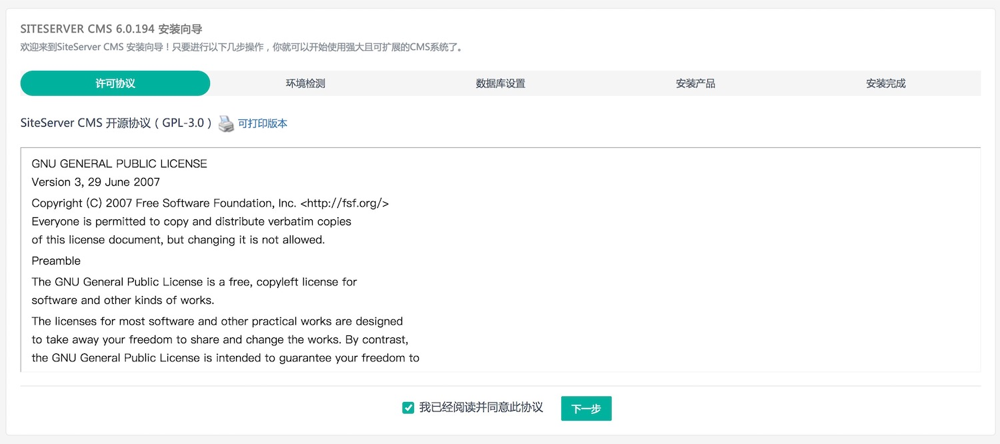

在这提醒一下，平时访问SiteServer CMS后台有时也会出现上面这个界面，最常见的三个原因： 
+ 数据库服务器没有连接不上了；或者数据库软件没有运行起来； 
+ 连接数据库的帐号被停用了或者密码被修改了导致连接不到数据库； 
+ SiteServer CMS数据存储的这个数据库或表被删除了； 

总之就是找不到数据库了，SiteServer CMS系统会判定还没有安装，所以就会跳到安装界面来。

点击继续，进入环境检测界面，如下图所示：

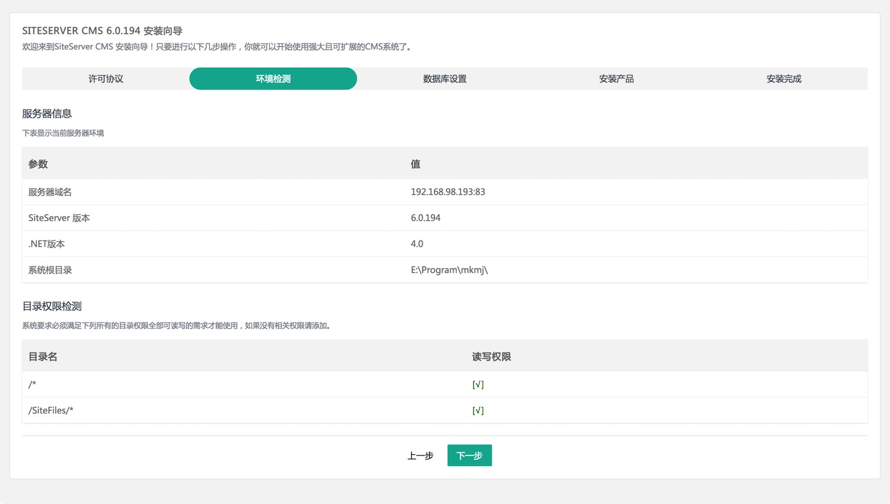

如果上图提示读写权限不够的话，如下图所示：

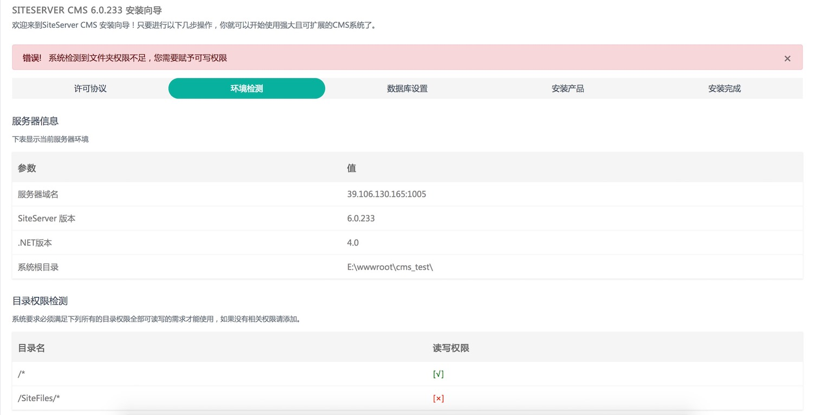

此时需要按照以下步骤赋予网站根目录（E:\siteserver_install）相应权限：

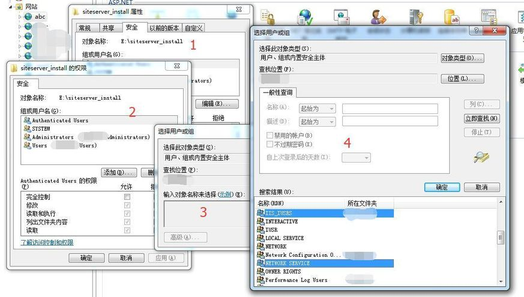

如上图所示：
1、打开IIS，选中相应站点名称（此例是abc）；
2、右键弹出菜单，选择“编辑权限”，切换到“安全”选项卡；
3、点“编辑” --> “添加” --> “高级” --> “立即查找”；
4、选中IIS_IUSER和NETWORK_SERVICE，点“确定”；
5、在退回到“编辑”界面时，如下图所示，需要对刚才添加两个用户别赋予“完全控制”权限；

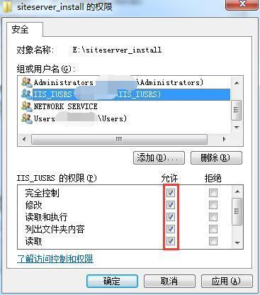

环境检测通过之后，点击下一步按钮进入 “数据库设置” 界面，如下图所示：

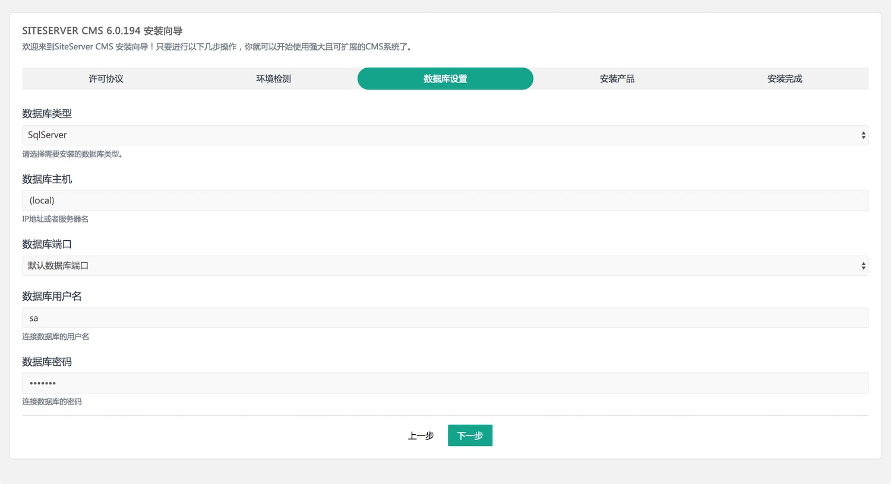

在上图中：
**数据库类型：** 目前支持SqlServer、MySql、PostgreSQL以及Oracle等主流数据库；
**数据库主机：** 如果数据库软件是安装在本机，则填写 “(local)” 即可，否则需要填写数据库服务器的IP；
**数据库端口：** 一般选择默认数据库端口即可，如果数据库软件默认端口被修改了，则需要选择自定义端口，然后填写修改后的端口值；

把连接数据库的帐号和密码填写完之后点击下一步，进入 “选择数据库” 界面，如下图所示：

如果没有出现如上图所示界面，提示 “在与 SQL Server 建立连接时出现与网络相关的或特定于实例的错误” 之类错误时，如下图所示：

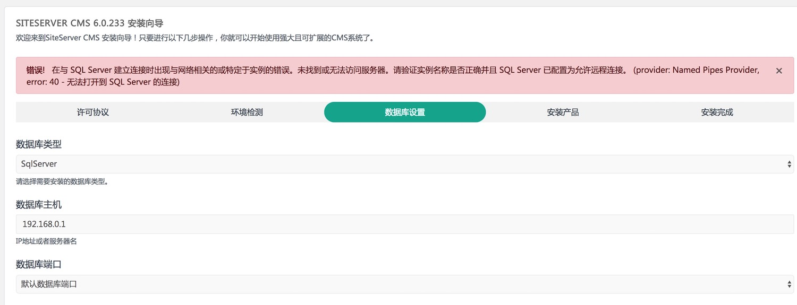

则可以到[FAQ](http://docs.siteserver.cn/faq/)上直接打开第11个问题，或者通过查询关键词“数据库连接失败”来搜索相应的解决方案。

选择完了数据库之后，点击下一步，进入 “设置管理员帐号” 界面，如下图所示：

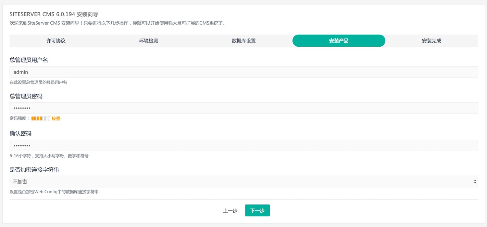

此帐号属于SiteServer CMS系统最高级别权限，所以帐号密码尽可能设置复杂一些，同时数据库连接字符串建议选择加密方式更安全。点击下一步，如果见到如下图所示界面表示SiteServer CMS安装成功。

