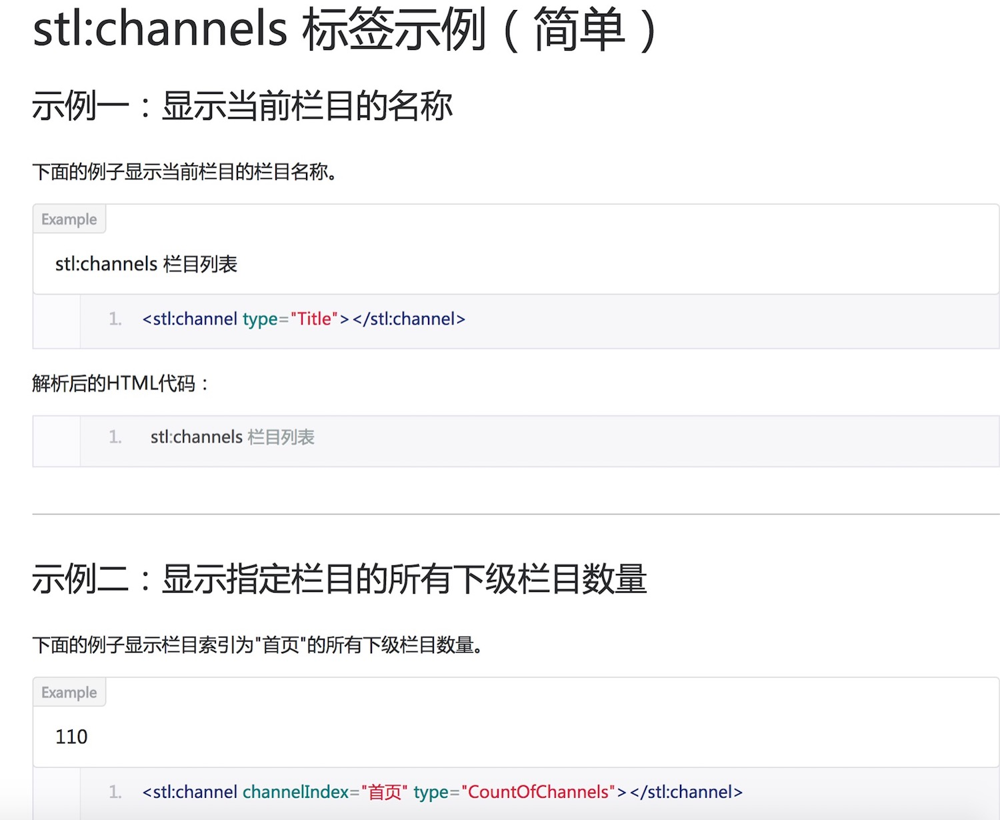

# 什么是STL语言？

> STL 语言全称称为 SiteServer 模版语言（SiteServer Template Language），是一种您可以用来创建显示模版的服务器端语言。STL 通过标记符号（元素及实体）来标记要调取并显示的各种网站数据及功能，通过SiteServer 解析引擎将对应标记转换为HTML 语言并在服务器中生成对应的静态页面文件。

## 1、主要功能

在不需要专业的程序开发人员的前提下，灵活调取SiteServer CMS 后台管理的各种数据，并解析成HTML，最终生成对应的静态页面文件。

## ２、语言特色

STL 语言由百容千域创建，用来克服 HTML 语言的局限。和 HTML 语言一样，STL 语言也是一种标准通用标记语言（SGML），采用与HTML 语言一致的语法和规则。STL 模版语言制作并不复杂，但功能强大，其主要特点如下：

+ **简易性：** STL 语言版本升级采用超集方式，从而更加灵活方便。

+ **可扩展性：** STL 语言的广泛应用带来了加强功能，增加标识符等要求，STL 语言采取子类元素的方式，为系统扩展带来保证。

+ **易学性：** 和HTML 语言规则保持一致确保了STL 语言易于学习，便于使用。

## 3、 书写方式

+ **基本文本、文档编辑软件：** 使用微软自带的记事本或写字板即可编写，当然，通常采用Dreamweaver等HTML编辑软件进行编辑。

+ **SiteServer 软件的模板编辑器：** SiteServer 软件中集成了STL 模板编辑器，能够显示行数、高亮、颜色标示以及对格式化代码等功能。

+ **所见即所得模板插件：** 这是我们推荐的方式，同时也是使用最广的方式，可以在无需记住STL 语言细节的情况下以最快速便捷的方式编写STL 语言，我们根据用户的习惯提供两款模板插件，包括Dreamweaver 模板插件以及Sublime Text 模板插件。采用模板插件方式，开发速度更快，效率更高，且直观的表现更强。

